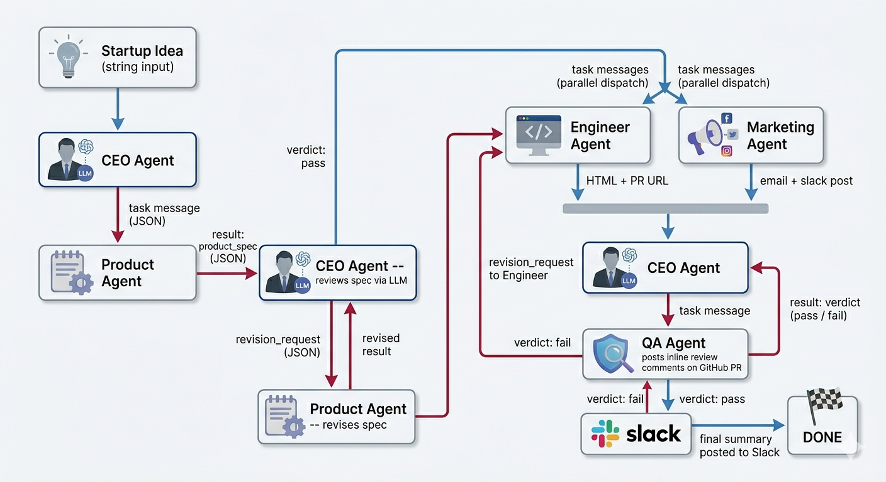

# LaunchMind

A Multi-Agent System (MAS) that autonomously runs a micro-startup from a single startup idea
through to GitHub pull requests, Slack announcements, and email outreach — without any human
intervention after the initial input.

---

## Startup Idea

A mobile application connecting customers with restaurants offering surplus end-of-day food at
discounted prices. Customers browse anonymously — no restaurant or brand names are shown during
browsing, only food details, quantity, and price. Orders are placed and paid entirely through the
app. Restaurants list leftover items, set discounted rates, and update availability in real time.
The service is delivery-only; no dine-in option is available.

---

## Agent Architecture



### Agent Responsibilities

| Agent | LLM Used | Responsibility |
|---|---|---|
| CEO Agent | GPT-4o | Orchestrates the full pipeline. Decomposes the startup idea into tasks. Reviews outputs from Product and QA agents. Sends revision requests when output quality is insufficient. Posts the final summary to Slack. |
| Product Agent | GPT-4o | Receives the startup idea and focus areas from the CEO. Generates a structured product specification including value proposition, user personas, prioritised features, and user stories. Revises the spec on request. |
| Engineer Agent | GPT-4o | Receives the product spec. Generates a complete HTML landing page. Creates a GitHub issue, commits the HTML to a new branch, and opens a pull request. Returns the PR URL and issue URL to the CEO. |
| Marketing Agent | GPT-4o | Receives the product spec. Generates a tagline, product description, cold outreach email, and three social media posts. Sends the email via Gmail SMTP and posts a Block Kit message to the Slack workspace. |
| QA Agent | GPT-4o | Receives the HTML and marketing copy from the CEO. Reviews both against the product spec using LLM reasoning. Posts at least two inline review comments on the GitHub pull request. Returns a structured pass/fail verdict to the CEO. |

---

## Message Schema

Every message passed between agents follows this structure:

```json
{
    "message_id": "uuid-string",
    "from_agent": "ceo",
    "to_agent": "product",
    "message_type": "task",
    "payload": {},
    "timestamp": "2026-04-08T10:00:00Z",
    "parent_message_id": "uuid-string-or-null"
}
```

Valid values for `message_type`: `task`, `result`, `revision_request`, `confirmation`

---

## Feedback Loops

The system implements two CEO-driven feedback loops:

**Loop 1 — Product Spec Review**
After the Product agent returns a spec, the CEO sends it to the LLM with a structured review
prompt. If the verdict is fail, the CEO sends a `revision_request` message back to the Product
agent with specific feedback. The Product agent revises and resubmits before the pipeline
continues.

**Loop 2 — QA Review**
After the QA agent returns its verdict, the CEO evaluates the result. If the verdict is fail,
the CEO sends a `revision_request` to the Engineer agent listing the specific issues raised by
QA. This demonstrates dynamic decision-making: the CEO's next action depends on LLM reasoning
over another agent's output, not a fixed sequence.

---

## Platform Integrations

| Platform | Agent | Action |
|---|---|---|
| GitHub | Engineer Agent | Creates a branch, commits `index.html`, opens a pull request, creates an issue |
| GitHub | QA Agent | Posts inline review comments on the pull request via the GitHub Reviews API |
| Slack | Marketing Agent | Posts a Block Kit formatted launch message to `#launches` |
| Slack | CEO Agent | Posts a final pipeline summary to `#launches` |
| Gmail | Marketing Agent | Sends a cold outreach email with LLM-generated subject and body via SMTP |

---

## Repository Structure

```
launchmind-team01/
    agents/
        ceo_agent.py
        product_agent.py
        engineer_agent.py
        marketing_agent.py
        qa_agent.py
    main.py
    message_bus.py
    requirements.txt
    .env.example
    .gitignore
    README.md
```

---

## Group Members

| Member | Agent Ownership |
|---|---|
| 22I2049 HASNAT NOOR HASSAN | CEO Agent |
| 22I1974 HAMZA ZAHID | Product Agent, Engineer Agent |
| 22I2009 TAHA RASHEED | Marketing Agent, QA Agent |

---

## Setup Instructions

### Prerequisites

- Python 3.10 or higher
- A GitHub account with a personal access token (PAT) with `repo` and `workflow` scopes
- A Slack workspace with a bot app installed and a `#launches` channel
- A Gmail account with an App Password generated
- An OpenAI API key

### Installation

```bash
git clone https://github.com/hasnatnoorhassan/launchmind-team01.git
cd launchmind-team01
pip install -r requirements.txt
```

### Environment Variables

Copy the example file and fill in your credentials:

```bash
cp .env.example .env
```

| Variable | Description |
|---|---|
| `OPENAI_API_KEY` | OpenAI API key used by all agents |
| `GITHUB_TOKEN` | GitHub PAT with repo and workflow permissions |
| `GITHUB_REPO` | Repository in the format `username/repo-name` |
| `SLACK_BOT_TOKEN` | Slack Bot OAuth Token beginning with `xoxb-` |
| `GMAIL_SENDER` | Gmail address used as the sending address |
| `GMAIL_APP_PASSWORD` | 16-character Gmail App Password (no spaces) |
| `GMAIL_RECEIVER` | Email address that receives the test outreach email |

### Running the System

```bash
python main.py
```

The system will run the full pipeline end to end. All agent messages are printed to the terminal
as they are sent and received. The complete message history is printed at the end of the run.

---

## Deliverables

- **GitHub Pull Request (Engineer Agent):** https://github.com/hasnatnoorhassan/launchmind-team01/pull/3
- **Slack Workspace Invite:** [Insert invite link]
- **Demo Video:** [Insert video link]
